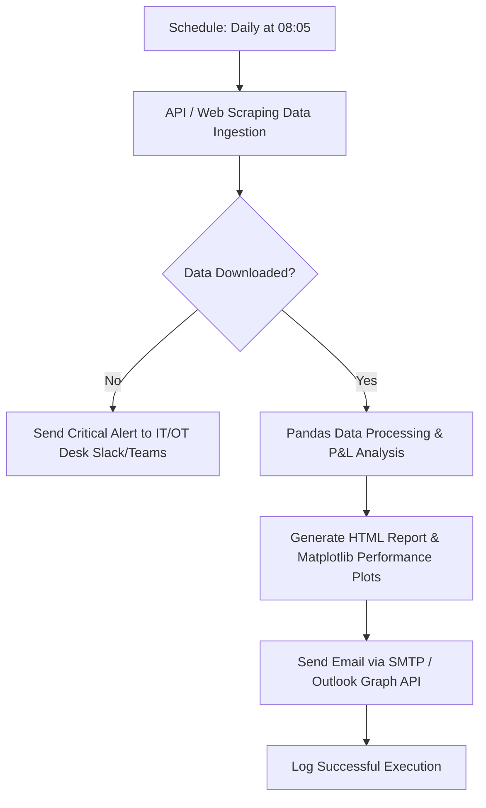

# E.ON 50 MW BESS Integration and Performance Tracking - Case Study Solution

Comprehensive solution for integrating and tracking E.ON's new 50 MW / 100 MWh Battery Energy Storage System (BESS) in Bavaria for short-term trading optimizations.

---

## Task 1: Translating Operational Needs into IT Specifications (User Story & Acceptance Criteria)

To prevent the algorithmic trading bot from submitting sell orders when the battery is empty (avoiding grid imbalance penalties), we define a clear, agile requirement specification:

### Agile User Story

*   **AS A:** Short-Term Trading Algorithmic Bot,
*   **I WANT TO:** Check the battery's real-time State of Charge (SoC) before submitting any sell order to the Intraday market,
*   **SO THAT:** We block orders that exceed the physical capacity of the BESS, preventing grid imbalance charges and protecting the battery system from over-discharge.

---

### Acceptance Criteria (Gherkin Format)

#### Scenario 1: Successful Sell Order Execution (Sufficient SoC)
*   **GIVEN** the Algorithmic Trading Bot has generated a sell order of $X$ MWh.
*   **AND** the telemetry system reports the current State of Charge as $SoC_{current}$ and the minimum safety limit as $SoC_{min}$.
*   **AND** the usable energy ($SoC_{current} - SoC_{min}$) is equal to or greater than the requested order volume $X$ MWh.
*   **WHEN** the bot triggers the submission of the order to the Intraday market.
*   **THEN** the bot submits the sell order successfully.
*   **AND** logs the event: `[INFO] Order submitted. Required: X MWh, Available: (SoC_current - SoC_min) MWh`.

#### Scenario 2: Fail-Safe Order Blocking (Insufficient SoC)
*   **GIVEN** the Algorithmic Trading Bot has generated a sell order of $X$ MWh.
*   **AND** the usable energy ($SoC_{current} - SoC_{min}$) is less than the requested order volume $X$ MWh.
*   **WHEN** the bot attempts to submit the order.
*   **THEN** the bot blocks and cancels the order before it reaches the exchange.
*   **AND** logs a warning: `[WARNING] Order blocked. Insufficient SoC. Required: X MWh, Available: (SoC_current - SoC_min) MWh`.
*   **AND** triggers a real-time notification on the Short-Term Trading desk operations screen.

#### Scenario 3: Telemetry Connection Loss (Safety Lock)
*   **GIVEN** the bot is about to place a trading order.
*   **WHEN** the API connection to the battery management system (BMS) or telemetry database fails or times out (> 500ms).
*   **THEN** the bot defaults to a "safety lock" mode, blocking all new trading orders.
*   **AND** sends a critical alert to the IT/OT support team: `[CRITICAL] Telemetry Connection Lost. Safe mode activated.`.

---

## Task 2: Data Analytics and Visualization (Power BI & SQL)

Visualizing BESS financial and operational performance on a daily basis.

### 3 Key Performance Indicators (KPIs)

1.  **Daily Net Arbitrage Revenue / Profit & Loss (P&L):**
    *   *Description:* Total revenue generated from discharging (selling) electricity minus total cost incurred from charging (buying) electricity, factoring in system degradation.
    *   *Formula:* $\sum (\text{Sell Price} \times \text{Discharged Volume}) - \sum (\text{Buy Price} \times \text{Charged Volume})$
2.  **Round-Trip Efficiency (RTE %):**
    *   *Description:* Ratio of total physical energy discharged to total physical energy charged. Measures electrical and thermal conversion losses. Expected range: 85% to 90% for modern Li-ion systems.
    *   *Formula:* $(\text{Total Discharged Physical Energy [MWh]} / \text{Total Charged Physical Energy [MWh]}) \times 100$
3.  **Equivalent Daily Cycles:**
    *   *Description:* A metric tracking battery cell degradation. One cycle represents the full charge/discharge of the nominal capacity (100 MWh). Used to monitor battery health against warranty constraints (e.g. max 1.5 cycles/day).
    *   *Formula:* $\text{Total Daily Physical Discharge [MWh]} / \text{Nominal Battery Capacity [MWh]}$

---

### Database Schemas

We need two logical tables to calculate these KPIs:

1.  **`trades_table` (Bilateral Trade Data):**
    *   `trade_id` (PK): Unique transaction ID.
    *   `timestamp`: Transaction execution timestamp.
    *   `trade_direction`: Action type ('BUY' for charging, 'SELL' for discharging).
    *   `volume_mwh`: Executed volume (MWh).
    *   `price_eur_per_mwh`: Clearing price (€/MWh).
    *   `execution_status`: Transaction status ('COMPLETED', 'FAILED', etc.).

2.  **`battery_status_table` (BESS Physical Telemetry Data):**
    *   `telemetry_id` (PK): Unique sensor log ID.
    *   `timestamp`: 5-minute interval timestamp.
    *   `power_mw`: Active power (negative values denote charging, positive values denote discharging).
    *   `soc_percentage`: Current State of Charge percentage (%).
    *   `soc_mwh`: Current energy stored (MWh).
    *   `battery_temperature`: Internal battery cell temperature (°C).

---

### SQL Query for Power BI Report

```sql
WITH daily_trades AS (
    SELECT 
        CAST(timestamp AS DATE) AS trade_date,
        SUM(CASE WHEN trade_direction = 'BUY' THEN volume_mwh * price_eur_per_mwh ELSE 0 END) AS total_buy_cost,
        SUM(CASE WHEN trade_direction = 'SELL' THEN volume_mwh * price_eur_per_mwh ELSE 0 END) AS total_sell_revenue,
        SUM(CASE WHEN trade_direction = 'BUY' THEN volume_mwh ELSE 0 END) AS charged_volume_trade,
        SUM(CASE WHEN trade_direction = 'SELL' THEN volume_mwh ELSE 0 END) AS discharged_volume_trade
    FROM trades_table
    WHERE execution_status = 'COMPLETED'
    GROUP BY CAST(timestamp AS DATE)
),
daily_telemetry AS (
    -- 5-minute interval readings (5 mins = 1/12 hour)
    SELECT 
        CAST(timestamp AS DATE) AS telemetry_date,
        SUM(CASE WHEN power_mw < 0 THEN ABS(power_mw) * (5.0/60.0) ELSE 0 END) AS physical_charged_mwh,
        SUM(CASE WHEN power_mw > 0 THEN power_mw * (5.0/60.0) ELSE 0 END) AS physical_discharged_mwh
    FROM battery_status_table
    GROUP BY CAST(timestamp AS DATE)
)
SELECT 
    t.trade_date,
    -- KPI 1: Net Arbitrage Revenue
    (t.total_sell_revenue - t.total_buy_cost) AS net_arbitrage_revenue_eur,
    t.charged_volume_trade AS traded_charge_mwh,
    t.discharged_volume_trade AS traded_discharge_mwh,
    -- KPI 2: Round-Trip Efficiency (RTE)
    CASE 
        WHEN tel.physical_charged_mwh > 0 
        THEN (tel.physical_discharged_mwh / tel.physical_charged_mwh) * 100 
        ELSE NULL 
    END AS round_trip_efficiency_percentage,
    -- KPI 3: Equivalent Cycles (Assuming 100 MWh BESS)
    (tel.physical_discharged_mwh / 100.0) AS daily_equivalent_cycles
FROM daily_trades t
JOIN daily_telemetry tel ON t.trade_date = tel.telemetry_date
ORDER BY t.trade_date DESC;
```

---

## Task 3: Process Automation (Python)

Replacing the manual process of downloading CSV files, calculating P&L in Excel, and sending emails.

### Automation Workflow



1.  **Orchestration:** Scheduled via **cron job** or **Apache Airflow** daily at 08:05 (providing a buffer for exchange data publications).
2.  **Extraction:** Automatically logs into the exchange portal API using `requests` (or automated scraping via `Playwright` if API is unavailable) to download yesterday's executed trades.
3.  **Processing:** Read using `pandas`, filtering out incomplete orders, calculating net transaction margins, and generating a performance graph using `matplotlib`.
4.  **Distribution:** The Python script constructs an HTML email body, embeds the performance plot, and sends it using `smtplib` or the enterprise Microsoft Graph API to the trading distribution group.
5.  **Monitoring:** Standard logging tracks failures, sending immediate Webhook notifications (Slack/Teams) to the IT support channel if an extraction error occurs.
