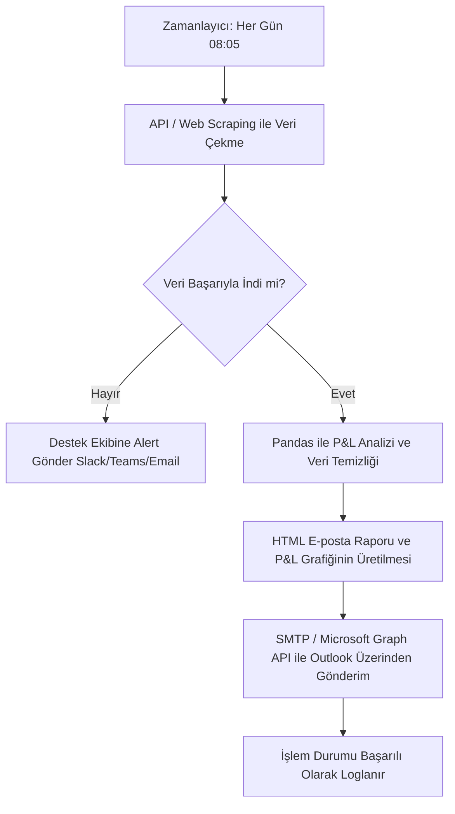

# E.ON 50 MW BESS Entegrasyonu ve Takibi - Vaka Çözümü

Bavyera'da kurulan 50 MW kapasiteli yeni Batarya Enerji Depolama Sistemi'nin (BESS) Intraday piyasasında verimli ve güvenli şekilde çalıştırılması için hazırlanan 3 aşamalı çözüm planı aşağıda detaylandırılmıştır.

---

## Görev 1: Operasyonel İhtiyacı IT İçin Çevirmek (User Story & Acceptance Criteria)

Algoritmik trading botunun, batarya boşken satış emri vermesini engellemek ve şebeke dengesizliği kaynaklı finansal cezaların önüne geçmek amacıyla hazırlanan teknik çevik iş tanımı:

### Kullanıcı Hikayesi (User Story)

*   **AS A (Kim olarak):** Kısa Vadeli Ticaret (Short-Term Trading) Algoritma Botu,
*   **I WANT TO (Ne yapmak istiyorum):** Piyasaya her satış emri (Sell Order) göndermeden önce BESS'in anlık doluluk oranını (State of Charge - SoC) kontrol etmek,
*   **SO THAT (Hangi amaçla):** Bataryada fiziksel olarak yeterli enerji yoksa satış emri iletmeyerek gerçekleşmeyen yükümlülüklerden kaynaklı finansal cezaları önlemek ve sistem dengesini korumak.

---

### Kabul Kriterleri (Acceptance Criteria - Gherkin Formatında)

#### Senaryo 1: Bataryada Yeterli SoC Durumunda Satış Emri Gönderilmesi
*   **GIVEN (Koşul):** Algoritmik trading botu $X$ MWh miktarında bir satış emri oluşturdu.
*   **AND:** Telemetri sisteminden alınan güncel batarya doluluk oranı $SoC_{current}$ ve izin verilen minimum güvenlik sınırı $SoC_{min}$ değeridir.
*   **AND:** Bataryadaki kullanılabilir enerji miktarı ($SoC_{current} - SoC_{min}$), sipariş miktarı olan $X$ MWh değerine eşit veya büyüktür.
*   **WHEN (Eylem):** Bot, Intraday piyasasına satış emri gönderme tetiklemesini çalıştırır.
*   **THEN (Sonuç):** Bot, satış emrini borsaya başarıyla iletir.
*   **AND:** İşlem loglarına `[INFO] Order submitted. Required: X MWh, Available: (SoC_current - SoC_min) MWh` kaydı düşülür.

#### Senaryo 2: Yetersiz SoC Durumunda Satış Emrinin Reddedilmesi (Fail-Safe)
*   **GIVEN:** Algoritmik trading botu $X$ MWh miktarında bir satış emri oluşturdu.
*   **AND:** Bataryadaki kullanılabilir enerji miktarı ($SoC_{current} - SoC_{min}$), sipariş miktarı olan $X$ MWh değerinden küçüktür.
*   **WHEN:** Bot, satış emri gönderme adımına geçer.
*   **THEN:** Bot, siparişi borsaya iletmeden engeller ve iptal eder.
*   **AND:** Sistem `[WARNING] Order blocked. Insufficient SoC. Required: X MWh, Available: (SoC_current - SoC_min) MWh` uyarısını loglar.
*   **AND:** Kısa vadeli ticaret masasının operasyon ekranına ve ilgili Slack/Teams kanalına anlık alarm gönderilir.

#### Senaryo 3: Telemetri Verisine Erişilememe Durumu (Safety Lock)
*   **GIVEN:** Bot satış kararı aşamasındadır.
*   **WHEN:** Telemetri veri tabanı veya API servisinden anlık SoC verisi alınamazsa (Timeout > 500ms veya Bağlantı Hatası).
*   **THEN:** Sistem güvenli moda geçerek tüm yeni satış emirlerini askıya alır (Block-by-default).
*   **AND:** Destek (IT/OT) ekibine `[CRITICAL] Telemetry Connection Lost. Safe mode activated.` uyarısı iletilir.

---

## Görev 2: Veri Analitiği ve Görüntüleme (Power BI & SQL)

Yöneticinin bataryanın performansını günlük olarak izlemesi için tasarlanan Power BI Dashboard yapısı:

### Ekrana Konulacak 3 Temel Metrik / KPI (Anahtar Performans Göstergesi)

1.  **Günlük Net Arbitraj Geliri (Daily Net Arbitrage Revenue / P&L):**
    *   *Açıklama:* Gün boyunca yapılan satış işlemlerinden (Discharge) elde edilen toplam gelirden, şarj (Charge) için harcanan elektrik maliyetinin çıkarılması ile elde edilen net finansal kazanç.
    *   *Formül:* $\sum (\text{Satış Fiyatı} \times \text{Satılan Miktar}) - \sum (\text{Alış Fiyatı} \times \text{Alınan Miktar})$
2.  **Gidiş-Dönüş Verimliliği (Round-Trip Efficiency - RTE %):**
    *   *Açıklama:* Bataryaya şarj edilen enerji ile bataryadan çekilip şebekeye verilen enerji arasındaki oran. Sistemin elektriksel kayıplarını ve verimliliğini izlemek için kritiktir. Normal şartlarda %85-%90 bandında olması beklenir.
    *   *Formül:* $(\text{Toplam Deşarj Edilen Fiziksel Enerji [MWh]} / \text{Toplam Şarj Edilen Fiziksel Enerji [MWh]}) \times 100$
3.  **Günlük Eşdeğer Döngü Sayısı (Daily Equivalent Cycles):**
    *   *Açıklama:* Bataryanın ömrünü (degradasyon) takip etmek için kullanılan temel operasyonel metrik. Bataryanın nominal kapasitesinin kaç kez tam doldur-boşalt yapıldığını gösterir.
    *   *Formül:* $\text{Günlük Toplam Deşarj Miktarı [MWh]} / \text{Batarya Nominal Kapasitesi [MWh]}$

---

### İhtiyaç Duyulan SQL Tablo Yapıları

Bu metrikleri hesaplamak için veri tabanında mantıksal olarak iki ana tabloya ihtiyaç vardır:

1.  **`trades_table` (İşlem Verileri):**
    *   `trade_id` (PK): Benzersiz işlem ID'si.
    *   `timestamp`: İşlemin gerçekleştiği zaman (UTC/Yerel).
    *   `trade_direction`: İşlem yönü ('BUY' = Şarj için alış, 'SELL' = Deşarj için satış).
    *   `volume_mwh`: İşlem hacmi (MWh cinsinden).
    *   `price_eur_per_mwh`: İşlem fiyatı (€/MWh).
    *   `execution_status`: İşlem durumu ('COMPLETED', 'FAILED' vb.).

2.  **`battery_status_table` (Fiziksel Telemetri Verileri):**
    *   `telemetry_id` (PK): Benzersiz kayıt ID'si.
    *   `timestamp`: Ölçüm zamanı (örneğin 5 dakikalık periyotlarla).
    *   `power_mw`: Bataryanın o anki gücü (Negatif değerler Şarj, Pozitif değerler Deşarj durumunu gösterir).
    *   `soc_percentage`: State of Charge yüzdesi (%).
    *   `soc_mwh`: MWh cinsinden bataryada depolanmış enerji.
    *   `battery_temperature`: Batarya sıcaklığı (°C) - Güvenlik takibi için.

---

### Örnek SQL Sorgusu (Power BI Veri Kaynağı İçin)

```sql
WITH daily_trades AS (
    SELECT 
        CAST(timestamp AS DATE) AS trade_date,
        SUM(CASE WHEN trade_direction = 'BUY' THEN volume_mwh * price_eur_per_mwh ELSE 0 END) AS total_buy_cost,
        SUM(CASE WHEN trade_direction = 'SELL' THEN volume_mwh * price_eur_per_mwh ELSE 0 END) AS total_sell_revenue,
        SUM(CASE WHEN trade_direction = 'BUY' THEN volume_mwh ELSE 0 END) AS charged_volume_trade,
        SUM(CASE WHEN trade_direction = 'SELL' THEN volume_mwh ELSE 0 END) AS discharged_volume_trade
    FROM trades_table
    WHERE execution_status = 'COMPLETED'
    GROUP BY CAST(timestamp AS DATE)
),
daily_telemetry AS (
    -- 5 dakikalık telemetri verilerinden fiziksel şarj/deşarj miktarlarını hesaplar (5 dk = 1/12 saat)
    SELECT 
        CAST(timestamp AS DATE) AS telemetry_date,
        SUM(CASE WHEN power_mw < 0 THEN ABS(power_mw) * (5.0/60.0) ELSE 0 END) AS physical_charged_mwh,
        SUM(CASE WHEN power_mw > 0 THEN power_mw * (5.0/60.0) ELSE 0 END) AS physical_discharged_mwh
    FROM battery_status_table
    GROUP BY CAST(timestamp AS DATE)
)
SELECT 
    t.trade_date,
    -- 1. KPI: Net Arbitraj Geliri (EUR)
    (t.total_sell_revenue - t.total_buy_cost) AS net_arbitrage_revenue_eur,
    t.charged_volume_trade AS traded_charge_mwh,
    t.discharged_volume_trade AS traded_discharge_mwh,
    -- 2. KPI: Gidiş-Dönüş Verimliliği (RTE)
    CASE 
        WHEN tel.physical_charged_mwh > 0 
        THEN (tel.physical_discharged_mwh / tel.physical_charged_mwh) * 100 
        ELSE NULL 
    END AS round_trip_efficiency_percentage,
    -- 3. KPI: Eşdeğer Döngü Sayısı (Örn. 100 MWh kapasiteli batarya varsayımıyla)
    (tel.physical_discharged_mwh / 100.0) AS daily_equivalent_cycles
FROM daily_trades t
JOIN daily_telemetry tel ON t.trade_date = tel.telemetry_date
ORDER BY t.trade_date DESC;
```

---

## Görev 3: Süreç Otomasyonu (Python)

Stajyerin her sabah manuel yaptığı CSV indirme, P&L hesaplama ve e-posta gönderme sürecini tamamen otomatikleştirecek mimari ve Python akışı aşağıda sunulmuştur.

### Otomasyon Akışı (Workflow)



### Python ile Otomasyon Kurgusu

Süreç, bulut üzerinde (AWS Lambda, Azure Functions) veya lokal bir sunucuda (Windows Task Scheduler / Linux Cron) her sabah saat 08:05'te çalışacak bir Python betiği olarak kurgulanacaktır:

1.  **Zamanlama (Orchestration):** Betik, **Apache Airflow** gibi bir iş akışı aracı veya basit bir **Cron Job / Windows Task Scheduler** ile tetiklenir.
2.  **Veri Çekme (Data Ingestion):** Enerji borsasının (örn. EPEX SPOT) API'si varsa `requests` kütüphanesiyle veri çekilir. Eğer API yoksa `Playwright` veya `Selenium` kullanılarak borsa portalına otomatik login olunup dünün CSV dosyası indirilir.
3.  **Veri Analizi (Data Processing):** `pandas` kütüphanesi ile veriler okunarak dünün alış ve satış hacimleri, ortalama fiyatlar ve Net P&L hesaplanır. `matplotlib` ile günlük fiyat/hacim dağılımı grafiği çıkarılır.
4.  **E-posta Entegrasyonu (Notification):** Python'ın `smtplib` ve `email` modülleri ile zengin içerikli bir HTML e-postası şablonu oluşturulur. Hesaplanan metrikler bu şablona gömülür ve grafik ek olarak eklenir. Şirketin SMTP sunucusu veya MS Graph API kullanılarak trading grubuna gönderilir.
5.  **Hata Yönetimi (Logging & Alerting):** Olası bir hata durumunda (borsa portalının çökmesi, internet kesintisi) stajyerin veya IT ekibinin anında haberdar olması için `try-except` blokları içinde Slack/Teams webhook'u ile anlık alarm atılır.

---

### Örnek Python Kod Şablonu

```python
import os
import datetime
import smtplib
from email.mime.multipart import MIMEMultipart
from email.mime.text import MIMEText
from email.mime.image import MIMEImage
import pandas as pd
import matplotlib.pyplot as plt
import requests

# --- CONFIGURATION (Ortam Değişkenlerinden Alınır) ---
PORTAL_API_URL = "https://api.energy-exchange.com/v1/trades"
SMTP_SERVER = "smtp.office365.com"  # Outlook SMTP
SMTP_PORT = 587
SENDER_EMAIL = os.getenv("SENDER_EMAIL")
SENDER_PASSWORD = os.getenv("SENDER_PASSWORD")
RECIPIENT_EMAILS = ["trading-desk@eon.com", "management@eon.com"]
SLACK_WEBHOOK_URL = os.getenv("SLACK_WEBHOOK_URL")

def get_yesterday_trades():
    """Borsa API'sinden veya portalından bir önceki günün işlemlerini çeker."""
    yesterday = (datetime.date.today() - datetime.timedelta(days=1)).isoformat()
    headers = {"Authorization": "Bearer YOUR_API_TOKEN"}
    params = {"date": yesterday, "format": "csv"}
    
    response = requests.get(PORTAL_API_URL, headers=headers, params=params, timeout=30)
    if response.status_code != 200:
        raise Exception(f"Borsa portalından veri çekilemedi. Hata Kodu: {response.status_code}")
    
    # CSV verisini diske kaydet
    file_path = f"trades_{yesterday}.csv"
    with open(file_path, "wb") as file:
        file.write(response.content)
    return file_path

def analyze_performance(file_path):
    """Pandas kullanarak P&L ve hacim analizlerini gerçekleştirir."""
    df = pd.read_csv(file_path)
    
    # Hesaplamalar
    df['revenue'] = df.apply(
        lambda r: r['volume_mwh'] * r['price_eur_per_mwh'] if r['direction'] == 'SELL'
        else -r['volume_mwh'] * r['price_eur_per_mwh'], axis=1
    )
    
    total_buy_volume = df[df['direction'] == 'BUY']['volume_mwh'].sum()
    total_sell_volume = df[df['direction'] == 'SELL']['volume_mwh'].sum()
    total_pnl = df['revenue'].sum()
    
    avg_buy_price = df[df['direction'] == 'BUY']['price_eur_per_mwh'].mean()
    avg_sell_price = df[df['direction'] == 'SELL']['price_eur_per_mwh'].mean()
    
    # Grafik Oluşturma (Fiyat Dağılım Grafiği)
    plt.figure(figsize=(10, 5))
    plt.plot(df['timestamp'], df['price_eur_per_mwh'], label='Intraday Fiyatı (€/MWh)', color='#005A9C')
    plt.scatter(df[df['direction']=='BUY']['timestamp'], df[df['direction']=='BUY']['price_eur_per_mwh'], color='green', label='Şarj Alış', marker='^')
    plt.scatter(df[df['direction']=='SELL']['timestamp'], df[df['direction']=='SELL']['price_eur_per_mwh'], color='red', label='Deşarj Satış', marker='v')
    plt.title(f"BESS Günlük İşlem Grafiği - {datetime.date.today() - datetime.timedelta(days=1)}")
    plt.xlabel("Saat")
    plt.ylabel("Fiyat (€/MWh)")
    plt.legend()
    plt.grid(True)
    
    chart_path = "daily_chart.png"
    plt.savefig(chart_path, dpi=100)
    plt.close()
    
    metrics = {
        "pnl": total_pnl,
        "buy_vol": total_buy_volume,
        "sell_vol": total_sell_volume,
        "avg_buy": avg_buy_price,
        "avg_sell": avg_sell_price
    }
    return metrics, chart_path

def send_email_report(metrics, chart_path):
    """HTML tabanlı e-posta raporunu hazırlar ve Outlook üzerinden gönderir."""
    yesterday = (datetime.date.today() - datetime.timedelta(days=1)).strftime('%d.%m.%Y')
    
    msg = MIMEMultipart('related')
    msg['Subject'] = f"[BESS RAPORU] {yesterday} - Günlük Performans Analizi"
    msg['From'] = SENDER_EMAIL
    msg['To'] = ", ".join(RECIPIENT_EMAILS)
    
    pnl_color = "green" if metrics['pnl'] >= 0 else "red"
    
    html = f"""
    <html>
      <body style="font-family: Arial, sans-serif; color: #333;">
        <h2 style="color: #005A9C;">Bavyera 50 MW BESS Günlük Performans Raporu</h2>
        <p>Merhaba Ekip,</p>
        <p><b>{yesterday}</b> tarihine ait batarya işlem ve P&L sonuçları aşağıda bilgilerinize sunulmuştur:</p>
        
        <table border="1" cellpadding="8" style="border-collapse: collapse; border-color: #ddd; width: 80%;">
          <tr style="background-color: #f2f2f2;">
            <th>Metrik</th>
            <th>Değer</th>
          </tr>
          <tr>
            <td><b>Net Arbitraj Kar/Zarar (P&L)</b></td>
            <td style="color: {pnl_color}; font-weight: bold;">{metrics['pnl']:,.2f} EUR</td>
          </tr>
          <tr>
            <td>Toplam Şarj Hacmi (Buy)</td>
            <td>{metrics['buy_vol']:,.2f} MWh</td>
          </tr>
          <tr>
            <td>Toplam Deşarj Hacmi (Sell)</td>
            <td>{metrics['sell_vol']:,.2f} MWh</td>
          </tr>
          <tr>
            <td>Ortalama Şarj Alış Fiyatı</td>
            <td>{metrics['avg_buy']:,.2f} EUR/MWh</td>
          </tr>
          <tr>
            <td>Ortalama Deşarj Satış Fiyatı</td>
            <td>{metrics['avg_sell']:,.2f} EUR/MWh</td>
          </tr>
        </table>
        
        <p><b>Günlük İşlem Görselleştirmesi:</b></p>
        <br>
        
        <p style="font-size: 11px; color: #777;">*Bu e-posta sistem tarafından otomatik olarak üretilmiştir.</p>
      </body>
    </html>
    """
    
    msg_html = MIMEText(html, 'html')
    msg.attach(msg_html)
    
    # Grafik görselini gömülü olarak ekle
    with open(chart_path, 'rb') as img_file:
        msg_img = MIMEImage(img_file.read())
        msg_img.add_header('Content-ID', '<image1>')
        msg_img.add_header('Content-Disposition', 'inline', filename=chart_path)
        msg.attach(msg_img)
        
    # E-postayı gönder
    with smtplib.SMTP(SMTP_SERVER, SMTP_PORT) as server:
        server.starttls()
        server.login(SENDER_EMAIL, SENDER_PASSWORD)
        server.sendmail(SENDER_EMAIL, RECIPIENT_EMAILS, msg.as_string())

def send_slack_error_alert(error_message):
    """Bir hata durumunda Slack kanalına anlık uyarı iletir."""
    payload = {"text": f"🚨 *BESS Raporlama Otomasyonu Hatası!* \nDetay: {error_message}"}
    try:
        requests.post(SLACK_WEBHOOK_URL, json=payload, timeout=10)
    except Exception as e:
        print(f"Slack alarmı gönderilemedi: {e}")

if __name__ == "__main__":
    try:
        csv_file = get_yesterday_trades()
        results, chart = analyze_performance(csv_file)
        send_email_report(results, chart)
        print("Otomasyon başarıyla tamamlandı.")
    except Exception as err:
        send_slack_error_alert(str(err))
        print(f"Hata oluştu: {err}")
```
